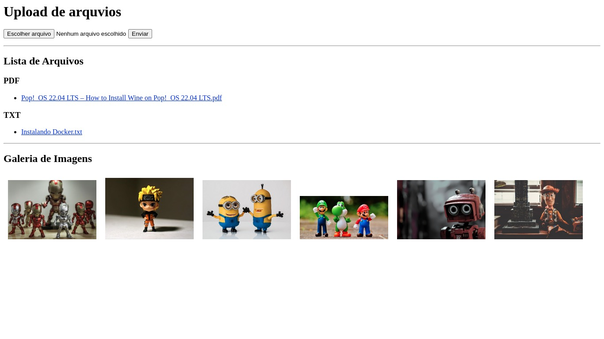

## **Imagem do sistema**

  

Este é um conjunto de códigos e um modelo HTML que cria uma aplicação web básica para upload de arquivos e exibição da lista de arquivos e galeria de imagens. Ele usa o framework Flask e algumas funções auxiliares definidas em outros módulos.

O arquivo `app.py` define a aplicação Flask e faz duas coisas principais:

- Ao acessar a URL raiz `'/'`, ele renderiza a página HTML usando o modelo `index.html` (que está na pasta `templates`) e passando duas variáveis: `file_list` e `image_gallery`. Essas variáveis são preenchidas pelas funções `get_file_list()` e `get_image_gallery()`, respectivamente.
- Quando um arquivo é enviado por meio do formulário HTML, ele salva o arquivo na pasta `'./arquivos'`.

O arquivo `file_list_utils.py` contém a função `get_file_list()`, que percorre todos os arquivos na pasta `'./arquivos'` e agrupa-os por extensão de arquivo. Ele retorna uma string HTML que pode ser usada diretamente no modelo `index.html` para exibir a lista de arquivos.

O arquivo `image_gallery_utils.py` contém a função `get_image_gallery()`, que percorre todos os arquivos na pasta `'./arquivos'` e filtra aqueles que são imagens (com extensões `.jpg`, `.jpeg` ou `.png`). Ele retorna uma string HTML que pode ser usada diretamente no modelo `index.html` para exibir a galeria de imagens.

O modelo HTML `index.html` contém o formulário de upload de arquivos, bem como as seções para exibir a lista de arquivos e a galeria de imagens. As variáveis `file_list` e `image_gallery`, que são preenchidas pelas funções `get_file_list()` e `get_image_gallery()`, respectivamente, são exibidas por meio de interpolação do template Jinja2.

Em geral, essa aplicação Flask básica pode ser usada como ponto de partida para criar um sistema de gerenciamento de arquivos mais avançado ou uma galeria de imagens na web.

